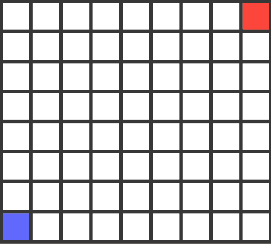

# UnityPractice
Unity学习项目

## BoidECS
使用Entities加Job的Boid群体行为算法, 模拟鱼群效果

## BatchRendererGroupTest
BatchRendererGroup+Animation Texture+JobSystem+RVO大批量角色渲染

## PathFinding
几种寻路算法Dijkstra, AStar, Jump Point Search, VectorField的学习和实现

## ProceduralAnimation
程序化动画，脚步运动由TwoBone IK的反向动力学控制四肢骨骼的位置和旋转到目标GameObject，
再另外单独目标,目标有反过来跟随固定的骨骼，当超过一定距离后将骨骼位置同步给目标，以达到壁虎四肢运动效果
https://weaverdev.io/projects/bonehead-procedural-animation

## Planar Shadow
平面阴影是通过光源的位置和物体的几何形状，将物体的顶点投影到一个定义好的平面上。通常这个平面是地板、墙壁或其他可以承载阴影的表面

## ComputeShader 
使用ComputeShader简单输出颜色到一个RenderTexture上
## UVSequenceFrameAnimation
shader的UV序列帧动画
## RenderObjectsRendererFeatureSample
根据官方文档制作, 物体被遮挡后以另一个Shader方式显示
